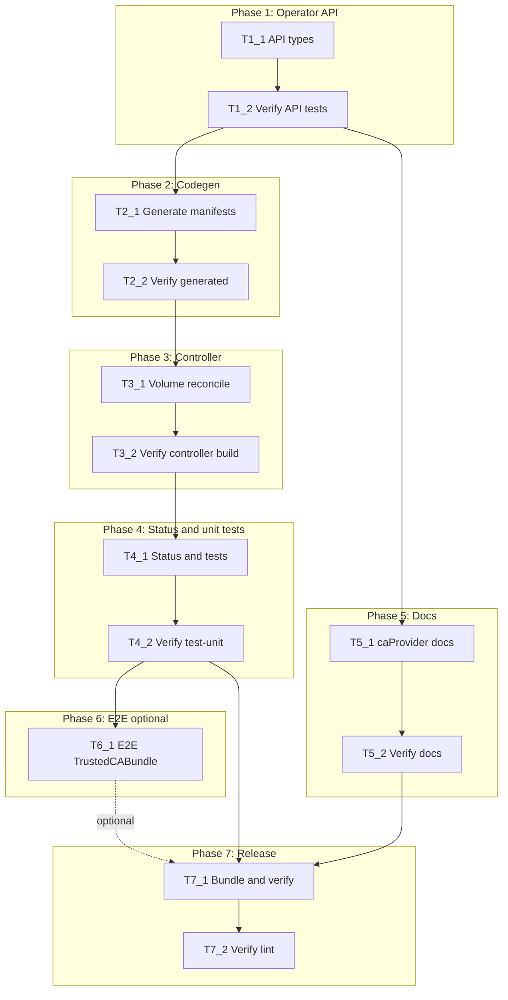

# Execution Backlog

**Feature:** RFE-8685 — Custom Enterprise CA Bundle Integration  
**AgentRoutingMode:** PROVIDED  
**ConstitutionVersion:** 1.0.0

## 0. Input coverage checklist

- **FR-001, FR-002, US-1, US-3** → T1_1, T2_1, T3_1, T4_1 (operator API + controller/webhook mounts)
- **FR-003, US-2, A-007** → T5_1 (store `caProvider` docs — no CRD tasks)
- **FR-004, SC-001** → T3_1, T4_1, T6_1 (optional e2e)
- **FR-005, FR-009, SC-003** → T3_1, T4_1
- **FR-006** → T3_1, T4_1, T6_1
- **FR-007, SC-004** → T4_1
- **FR-008, SC-005, US-4, A-011** → T3_1, T4_1, T6_1
- **FR-010** → T3_1 (no componentConfigs volume path)
- **SC-006** → T5_1
- **Plan Phase 1** → T1_1, T1_2
- **Plan Phase 2** → T2_1, T2_2
- **Plan Phase 3** → T3_1, T3_2
- **Plan Phase 4** → T4_1, T4_2
- **Plan Phase 5** → T5_1, T5_2
- **Plan Phase 6** → T6_1 (**optional** — cluster required)
- **Plan Phase 7** → T7_1, T7_2
- **Excluded by scope:** upstream `SecretStore`/`ClusterSecretStore` CRD, bindata operand CRD refresh, `hack/update-external-secrets-manifests.sh`

## 1. Task Dependency Graph (Mermaid)

## 2. Linear Execution Order (Chronological)

1. T1_1 — Add `additionalTrustedCAConfigMapRef` API types and testsuite cases — **done**
2. T1_2 — Verify API validation (`make test-apis`) — **done**
3. T2_1 — Regenerate deepcopy, CRD, API docs, bundle inputs — **done**
4. T2_2 — Verify generated artifacts (`make verify-generated`, `make verify`) — **done**
5. T3_1 — Implement controller volume projection and ConfigMap validation — **done**
6. T3_2 — Verify controller package compiles and tests run — **done**
7. T4_1 — Add ESC degraded status and A-011 unit test matrix — **done**
8. T4_2 — Verify full unit suite (`make test-unit`) — **done**
9. T5_1 — Author enterprise CA and store `caProvider` configuration doc — **deferred**
10. T5_2 — Verify documentation completeness (manual checklist)
11. T6_1 — **[OPTIONAL]** Add e2e `Feature:TrustedCABundle` spec (cluster required)
12. T7_1 — Final bundle regeneration and `make verify`
13. T7_2 — Run `make lint` and pre-merge test gate

## 3. Task Execution Manifest

| Task ID | Task Title | Assigned Agent | Phase | Depends On | Parallel OK | Complexity | Risk |
|---------|-----------|---------------|-------|------------|-------------|------------|------|
| T1_1 | Add `additionalTrustedCAConfigMapRef` to `CommonConfigs` | API_Agent | 1 | none | No | 3 | Low |
| T1_2 | Verify API testsuite for enterprise CA ref | API_Agent | 1 | T1_1 | No | 2 | Low |
| T2_1 | Run codegen, manifests, docs, bundle | API_Agent | 2 | T1_2 | No | 2 | Low |
| T2_2 | Verify generated CRD and deepcopy consistency | API_Agent | 2 | T2_1 | No | 2 | Med |
| T3_1 | Implement operand trusted CA volume reconcile | OperatorController_Agent | 3 | T2_2 | No | 8 | High |
| T3_2 | Verify controller package tests execute | OperatorController_Agent | 3 | T3_1 | No | 2 | Med |
| T4_1 | Add Degraded status and deployment unit tests | OperatorController_Agent | 4 | T3_2 | No | 5 | Med |
| T4_2 | Verify unit test suite passes | Testing_Agent | 4 | T4_1 | No | 2 | Low |
| T5_1 | Document ESC field and store `caProvider` usage | Docs_Agent | 5 | T1_2 | Yes | 3 | Low |
| T5_2 | Verify docs cover FR-003, A-007, SC-006 | Docs_Agent | 5 | T5_1 | No | 1 | Low |
| T6_1 | **[OPTIONAL]** E2e TrustedCABundle spec | Testing_Agent | 6 | T4_2 | Yes | 5 | Med |
| T7_1 | Regenerate OLM bundle and run verify | OLMRelease_Agent | 7 | T4_2, T5_2 | No | 3 | Med |
| T7_2 | Run lint and full test gate | OLMRelease_Agent | 7 | T7_1 | No | 2 | Low |

**Complexity total:** 40 points (excluding optional T6_1: 35)  
**High-risk tasks:** T3_1  
**Parallel OK:** T5_1 (after T1_2, disjoint from T2–T4 path until T7), T6_1 (optional, after T4_2)

## 4. Task Specifications (Payloads)

### Task T1_1: Add `additionalTrustedCAConfigMapRef` to `CommonConfigs`

- **Objective:** Introduce typed optional ConfigMap reference on ESC `spec.appConfig` per plan §3.1.
- **Target file(s):** `api/v1alpha1/meta.go`; `api/v1alpha1/external_secrets_config_types.go` (doc comments); `api/v1alpha1/tests/externalsecretsconfig.operator.openshift.io/externalsecretsconfig.testsuite.yaml`
- **Non-goals / forbidden edits:** No upstream `external-secrets.io` CRDs; no ESM `globalConfig` field; no controller code in this task.
- **Implementation notes:** Add struct with `name`, `namespace`, optional `key` (default documented in field comment). Use kubebuilder validation matching `ProxyConfig` style. Field name **`additionalTrustedCAConfigMapRef`** unless explicit API review renames during task. CEL: when ref object present, name and namespace required. Include positive/negative testsuite cases (missing namespace, empty name, valid ref).
- **Acceptance criteria:** Types compile; testsuite YAML covers valid + invalid refs; field appears under `appConfig` in OpenAPI schema after Phase 2.
- **Downstream handoff:** Stable API shape for codegen (T2_1) and controller getter (T3_1).

### Task T1_2: Verify API testsuite for enterprise CA ref

- **Objective:** Confirm CRD validation passes for new field (constitution IX — verification pairing).
- **Target file(s):** (verification only) `api/v1alpha1/tests/externalsecretsconfig.operator.openshift.io/externalsecretsconfig.testsuite.yaml`
- **Non-goals / forbidden edits:** No implementation changes unless tests fail.
- **Implementation notes:** Run `make test-apis`. Fix T1_1 only if validation failures occur.
- **Acceptance criteria:** `make test-apis` exits 0; all new testsuite cases pass.
- **Downstream handoff:** API gate cleared for codegen.

### Task T2_1: Run codegen, manifests, docs, bundle

- **Objective:** Regenerate all artifacts affected by API change (constitution VIII).
- **Target file(s):** `api/v1alpha1/zz_generated.deepcopy.go`; `config/crd/bases/operator.openshift.io_externalsecretsconfigs.yaml`; `docs/api_reference.md`; `bundle/manifests/operator.openshift.io_externalsecretsconfigs.yaml`
- **Non-goals / forbidden edits:** Do not hand-edit generated files; no bindata/operand CRD refresh.
- **Implementation notes:** Run `make generate && make manifests && make docs && make bundle` (or `make update` subset). Commit all generated outputs.
- **Acceptance criteria:** Generated files reflect `additionalTrustedCAConfigMapRef`; no manual edits in `zz_generated.*`.
- **Downstream handoff:** Controller agents consume updated CRD schema.

### Task T2_2: Verify generated CRD and deepcopy consistency

- **Objective:** CI parity check for codegen (constitution IX).
- **Target file(s):** (verification) generated paths from T2_1
- **Non-goals / forbidden edits:** None unless verify fails — then fix T2_1 outputs only.
- **Implementation notes:** Run `make verify-generated` and `make verify` (or full `make verify` if faster workflow). Ensure `check-git-diff` clean after regen.
- **Acceptance criteria:** `make verify` passes with no stale generated file diffs.
- **Downstream handoff:** Green codegen gate for controller work.

### Task T3_1: Implement operand trusted CA volume reconcile

- **Objective:** Mount enterprise CA on controller + webhook deployments; implement A-011 matrix (proxy × enterprise); validate user ConfigMap; optional RBAC update.
- **Target file(s):** `pkg/controller/external_secrets/constants.go`; `pkg/controller/external_secrets/utils.go`; `pkg/controller/external_secrets/configmap.go`; `pkg/controller/external_secrets/deployments.go`; `pkg/controller/external_secrets/install_external_secrets.go`; `pkg/controller/common/utils.go` (if `HasObjectChanged` needs volume projection); `config/rbac/role.yaml` (if cross-namespace ConfigMap get required — coordinate **RBACSecurity_Agent**)
- **Non-goals / forbidden edits:** No cert-controller/bitwarden deployment mounts; no CNO ConfigMap data writes; no upstream CRD/bindata; no SSA-first reconcile; keep `ensureTrustedCABundleConfigMap` proxy gate for platform CM.
- **Implementation notes:** Add getter for `additionalTrustedCAConfigMapRef`. Refactor `updateTrustedCABundleVolumes` to handle: (1) enterprise-only volume, (2) proxy-only unchanged, (3) projected volume merging CNO + enterprise ConfigMaps at `/etc/pki/tls/certs`, (4) neither. Validate ConfigMap exists and key has PEM content. Use create-or-update + `HasObjectChanged`. Wrap client errors with `common.FromClientError`.
- **Acceptance criteria:** Controller compiles; manual review confirms only `controllerDeploymentAssetName` and `webhookDeploymentAssetName` paths mutated; A-011 four-state matrix addressed in code.
- **Downstream handoff:** Reconcile behavior ready for unit tests (T4_1) and optional e2e (T6_1).

### Task T3_2: Verify controller package tests execute

- **Objective:** Smoke verification after controller implementation (constitution pairing).
- **Target file(s):** (verification) `pkg/controller/external_secrets/`
- **Non-goals / forbidden edits:** Add minimal test fixes only if compile failures block test run.
- **Implementation notes:** Run `go test ./pkg/controller/external_secrets/...`. Existing proxy/CA tests may fail until T4_1 updates expectations — document failures and proceed to T4_1 if expected.
- **Acceptance criteria:** Package builds; `go test ./pkg/controller/external_secrets/...` runs without compile errors.
- **Downstream handoff:** Controller compile gate cleared.

### Task T4_1: Add Degraded status and deployment unit tests

- **Objective:** FR-005/FR-009 status when ConfigMap missing/invalid; table tests for enterprise-only, proxy+enterprise projected, removal paths.
- **Target file(s):** `pkg/controller/external_secrets/controller.go`; `pkg/controller/external_secrets/deployments_test.go`; `pkg/controller/external_secrets/configmap_test.go` (new, if needed)
- **Non-goals / forbidden edits:** No e2e in this task; no docs.
- **Implementation notes:** Extend `deployments_test.go` patterns from existing proxy/CA cases. Test Degraded/Ready message when enterprise ref set but ConfigMap missing. Cover FR-007 removal revert. Use `FakeCtrlClient`.
- **Acceptance criteria:** New tests cover A-011 scenarios; status conditions set on validation failure paths.
- **Downstream handoff:** Unit coverage for verification matrix rows (FR-005, FR-007, FR-008 unit slice).

### Task T4_2: Verify unit test suite passes

- **Objective:** Constitution IX — `make test-unit` gate.
- **Target file(s):** (verification) `pkg/controller/...`
- **Non-goals / forbidden edits:** Fix failing tests from T4_1 scope only.
- **Implementation notes:** Run `make test-unit` (or `make test` for unit+apis if preferred pre-merge).
- **Acceptance criteria:** `make test-unit` exits 0.
- **Downstream handoff:** Core implementation verified without cluster.

### Task T5_1: Document ESC field and store `caProvider` usage

- **Objective:** FR-003 via documentation; explain A-007 independence; example ClusterSecretStore with ConfigMap CA; SC-006 declarative-only workflow.
- **Target file(s):** `docs/` (new focused doc, e.g. `docs/enterprise-trusted-ca.md` or extend `docs/integration-guidelines.md` — single doc preferred)
- **Non-goals / forbidden edits:** No CRD/bindata changes; no upstream helm refresh; no SecretStore schema edits.
- **Implementation notes:** Document `spec.appConfig.additionalTrustedCAConfigMapRef` (ESC) vs upstream `caProvider` on ClusterSecretStore. Include IBM/Thycotic-style internal vault example using existing CRD fields. Reference `EXTERNAL_SECRETS_VERSION` pin. RBAC prerequisites for cross-namespace ConfigMap read.
- **Acceptance criteria:** Doc covers FR-003, A-007, SC-006; links ESC operator path and store path separately.
- **Downstream handoff:** User-facing guidance for Phase 6 manual validation.

### Task T5_2: Verify documentation completeness (manual checklist)

- **Objective:** Verification pairing for docs task.
- **Target file(s):** (verification) doc from T5_1
- **Non-goals / forbidden edits:** None.
- **Implementation notes:** Reviewer checklist: ESC field documented; store `caProvider` example present; no instruction to edit bindata/CRD; proxy+enterprise behavior matches plan A-011.
- **Acceptance criteria:** Checklist signed off in implementation log or PR description.
- **Downstream handoff:** Docs gate cleared for release (T7_1).

### Task T6_1: **[OPTIONAL]** E2e TrustedCABundle spec

- **Objective:** SC-001–SC-005 cluster validation with Ginkgo label `Feature:TrustedCABundle`.
- **Target file(s):** `test/e2e/` (new spec file); `test/utils/` (helpers if needed)
- **Non-goals / forbidden edits:** No CRD/bindata changes; skip task entirely if no live cluster available.
- **Implementation notes:** Label per `docs/testing-guidelines.md`. Test enterprise CA mount on operand deployments; optional proxy coexistence sub-spec if cluster has OpenShift proxy. May require test ConfigMap with PEM CA. **Skip / defer** with documented reason if cluster unavailable — not blocking T7_1 per user directive.
- **Acceptance criteria:** When run: `make test-e2e E2E_GINKGO_LABEL_FILTER="Feature:TrustedCABundle"` passes. When skipped: noted in implementation report.
- **Downstream handoff:** E2E evidence for FR-004/FR-008 cluster paths.

### Task T7_1: Regenerate OLM bundle and run verify

- **Objective:** Phase 7 packaging — CSV/CRD bundle consistent (constitution XI).
- **Target file(s):** `bundle/`; `config/manifests/bases/openshift-external-secrets-operator.clusterserviceversion.yaml` (x-descriptors if applicable)
- **Non-goals / forbidden edits:** No operand version bump; no bindata refresh.
- **Implementation notes:** Run `make bundle` if not already current from T2_1; run `make verify`. Add CSV descriptor for new field if project convention requires.
- **Acceptance criteria:** `make verify` passes including bundle and git diff checks.
- **Downstream handoff:** Release-ready generated artifacts.

### Task T7_2: Run lint and full test gate

- **Objective:** Final constitution IX pre-merge gate.
- **Target file(s):** (verification) entire change set
- **Non-goals / forbidden edits:** Apply `make lint-fix` only for lint violations in touched files.
- **Implementation notes:** Run `make lint` and `make test`. Confirm `make update && make verify` if any late API/controller edits occurred.
- **Acceptance criteria:** `make lint` and `make test` exit 0; ready for `/opsx-apply` implementation stage.
- **Downstream handoff:** Implementation complete; unlock implementation-report artifacts.

## 5. Orchestration notes (non-code)

### Retry Boundaries

- **T1_1–T2_2:** Safe to retry codegen/regen independently; always rerun `make verify` after regen.
- **T3_1:** Highest rework risk — if projected volume approach fails e2e, revise within `deployments.go` only; do not expand to cert-controller without SME approval.
- **T6_1:** Optional — skip without blocking merge if unit coverage (T4_2) passes.
- **T7_x:** Rerun `make verify && make lint` after any fix-up commit.

### Merge Conflict Hotspots

- `api/v1alpha1/zz_generated.deepcopy.go` — regenerate, never manual merge.
- `config/crd/bases/operator.openshift.io_externalsecretsconfigs.yaml` — regenerate via `make manifests`.
- `bundle/manifests/*` — regenerate via `make bundle`.
- `pkg/controller/external_secrets/deployments.go` — coordinate T3_1 and T4_1 in same PR or sequential commits to avoid volume logic conflicts.
- **Not in scope:** `bindata/`, upstream `customresourcedefinition_*external-secrets.io*` — do not touch.

### Open Questions Requiring SME Before Execution

- **None blocking** — A-007 and A-011 resolved in approved plan.md §1 and §8.
- **Deferred (non-blocking):** ESM `globalConfig` parity for enterprise CA; cert-controller mounts; Thycotic-specific provider fields — do not create tasks unless SME opens scope.
